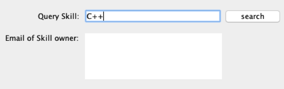

# Skill scan and query system     

This system is designed to help employers automatically read resumes and extract emails and skills that presents in the resume, so that employers can pick out the candidates with specfic skills and contact them very quickly.
The source code is written in java. Please read user manual for a detailed description on how to use this system.

