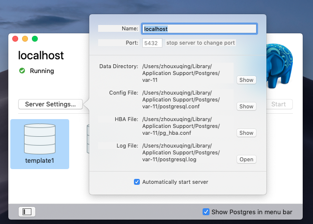
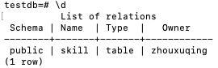
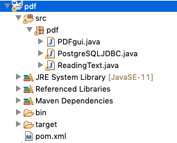
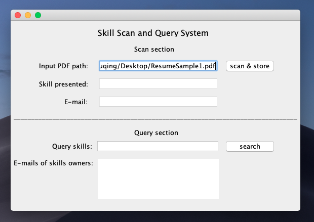
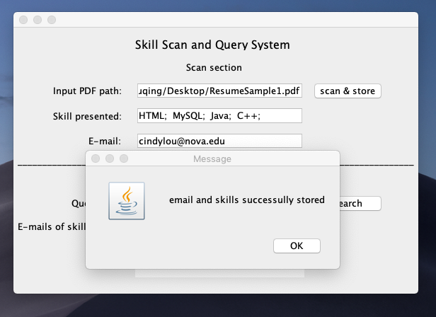
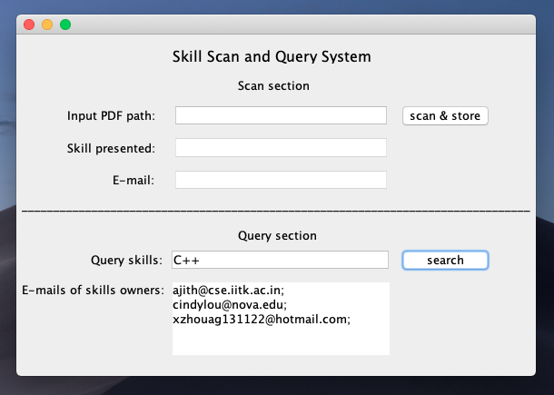
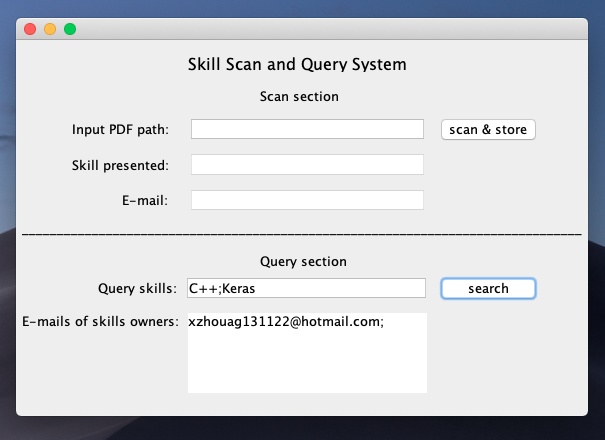

# Skill scan and query system     

This system (written in java) is designed to extract emails and skills in resumes and pick out the resume-owners with certain skills, so that employer can quickly identify and contact eligible employees.

# Set up Environment
## Step 1. download dependency components and build java path
pdfbox, jdbc and postgreSQL need to be downloaded, installed and properly added to the project path before running the source code. The following links will provides detailed instructions for each of them. 

Pdfbox:     https://www.tutorialspoint.com/pdfbox/pdfbox_reading_text.html

Jdbc:       https://jdbc.postgresql.org/download.html

PostgreSQL: https://www.tutorialspoint.com/postgresql/postgresql_java.htm

If your follow the steps in those links correctly. Your Java modulepath should looks like this:
## Path image

## Step 2. Create local Database on PostgreSQL
Run postgreSQL, name the server as 'localhost' and set the portal to be '5432' like this:

Open postgreSQL, type in the following commands:

create database testdb;

\c testdb

create table skill(email varchar(256), skill varchar(32));

\d

These commands will build a database named 'testdb', create a table named 'skill' in it, and show you the table. If do it correctly, you will get something like this: 

## Step3: Copy and run the source code
Source code can be found under the file 'src'. Copy all .java file into the project for which you set environment like this: (In the following screenhot, the project is named pdf)

Then open and run the gui.java file. If everything goes well. you will see the program interface:
## interface

# Tutorial
1. Use the scan function to scan pdf and store the extracted email and skill into the database:
Input the path of the target resume like this and press ‘scan & store’ button. 

You will see the skills and email presented in the resume and a message telling you that they are properly stored into the database: 

2. Use the query function to search for the emails of certain skill-owners. 
Input the skills you want to search and press 'search' button, the program will show you all the emails of the owner of the resumes that have been scaned before like this:

You can also input multiple skills using ';' as seperator to ask for the employees that have all the inputed skills like this:

